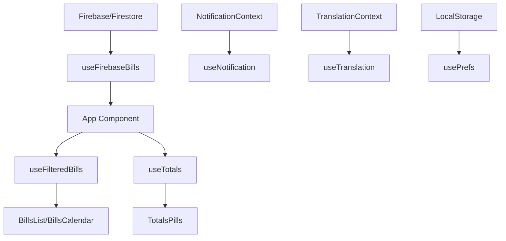

# 📋 Documentação de Engenharia de Software - Gerenciador de Contas

## 📖 Visão Geral

O **Gerenciador de Contas Pessoais** é uma aplicação web moderna desenvolvida em React com TypeScript para gerenciamento de contas a pagar. A aplicação oferece funcionalidades completas de CRUD, visualizações múltiplas (lista e calendário), sistema de recorrência, filtros avançados, exportação de dados e suporte a internacionalização.

### 🎯 Objetivos do Sistema
- Gerenciar contas a pagar de forma eficiente
- Oferecer múltiplas visualizações dos dados
- Suportar contas recorrentes (diária, semanal, mensal, anual)
- Permitir exportação para calendários externos (.ics)
- Fornecer interface multilíngue e responsiva
- Garantir persistência de dados na nuvem

---

## 🏗️ Arquitetura do Sistema

### Stack Tecnológico

| Categoria | Tecnologia | Versão | Propósito |
|-----------|------------|--------|-----------|
| **Frontend** | React | 19.1.1 | Biblioteca principal para UI |
| **Linguagem** | TypeScript | 5.8.3 | Tipagem estática e desenvolvimento |
| **Build Tool** | Vite | 7.1.2 | Bundler e servidor de desenvolvimento |
| **Styling** | Tailwind CSS | 4.1.12 | Framework CSS utilitário |
| **Backend** | Firebase/Firestore | 12.1.0 | Banco de dados NoSQL em tempo real |
| **Testes** | Vitest | 3.2.4 | Framework de testes |
| **Testing Library** | React Testing Library | 16.3.0 | Testes de componentes |

### Padrões Arquiteturais

#### 1. **Component-Based Architecture**
- Componentes funcionais com hooks
- Separação clara entre lógica e apresentação
- Reutilização através de componentes genéricos

#### 2. **Custom Hooks Pattern**
- Encapsulamento de lógica de estado
- Reutilização de funcionalidades
- Separação de responsabilidades

#### 3. **Context API Pattern**
- Gerenciamento de estado global
- Evita prop drilling
- Contextos especializados (Notificações, Traduções)

#### 4. **Repository Pattern**
- Abstração da camada de dados
- Hooks especializados para Firebase
- Facilita testes e manutenção

---

## 📁 Estrutura do Projeto

```
src/
├── app/                    # Ponto de entrada da aplicação
│   ├── App.tsx            # Componente principal
│   └── main.tsx           # Bootstrap da aplicação
├── components/            # Componentes React
│   ├── UI/               # Componentes de interface
│   │   ├── bills/        # Componentes específicos de contas
│   │   └── modals/       # Componentes de modal
│   └── layout/           # Componentes de layout
├── contexts/             # Contextos React
├── hooks/                # Custom hooks
├── types/                # Definições TypeScript
├── utils/                # Funções utilitárias
├── constants/            # Constantes e configurações
├── styles/               # Arquivos de estilo
└── test/                 # Configurações de teste
```

### Organização por Funcionalidade

#### **Components/UI/bills/**
- `BillsList.tsx` - Lista de contas
- `BillsCalendar.tsx` - Visualização em calendário
- `BillRow.tsx` - Item individual da lista
- `BillForm.tsx` - Formulário de criação/edição
- `MonthGrid.tsx` - Grid do calendário mensal

#### **Components/UI/modals/**
- `Settings.tsx` - Modal de configurações
- `AdminPanel.tsx` - Painel administrativo
- `DeleteConfirm.tsx` - Confirmação de exclusão
- `Modal.tsx` - Componente base de modal

#### **Components/layout/**
- `Header.tsx` - Cabeçalho da aplicação
- `Footer.tsx` - Rodapé
- `Filters.tsx` - Barra de filtros
- `Section.tsx` - Seção genérica

---

## 🔧 Componentes Principais

### App.tsx - Componente Raiz
```typescript
interface AppState {
  view: ViewType;           // 'list' | 'calendar'
  filter: FilterType;       // 'all' | 'today' | 'overdue' | 'next7' | 'next30'
  search: string;           // Termo de busca
  editing: Partial<Bill>;   // Conta em edição
  confirm: ConfirmState;    // Estado de confirmação
  monthDate: Date;          // Data do mês atual
  openSettings: boolean;    // Estado do modal de configurações
}
```

**Responsabilidades:**
- Gerenciamento do estado principal
- Coordenação entre componentes
- Integração com hooks de dados
- Controle de modais e navegação

### Custom Hooks

#### useFirebaseBills
```typescript
interface UseFirebaseBillsReturn {
  bills: Bill[];                    // Lista de contas
  loading: boolean;                 // Estado de carregamento
  upsertBill: (bill: Bill) => void; // Criar/atualizar conta
  removeBill: (id: string) => void; // Remover conta
  markPaid: (id: string) => void;   // Marcar como paga
}
```

**Funcionalidades:**
- Sincronização em tempo real com Firestore
- Operações CRUD completas
- Tratamento de erros
- Gerenciamento de recorrência

#### useTotals
```typescript
interface Totals {
  allOpen: number;    // Total de contas abertas
  monthOpen: number;  // Total do mês atual
  overdue: number;    // Total de contas atrasadas
  countOpen: number;  // Quantidade de contas abertas
}
```

#### useFilteredBills
- Filtragem por tipo (todas, hoje, atrasadas, próximos 7/30 dias)
- Busca textual por título, categoria e tags
- Otimização com useMemo

---

## 🗄️ Modelo de Dados

### Interface Bill
```typescript
interface Bill {
  id?: string;                    // ID único (Firestore)
  title: string;                  // Título da conta
  amount: number;                 // Valor
  dueDate: string;               // Data de vencimento (ISO)
  recurrence: RecurrenceType;     // Tipo de recorrência
  paid: boolean;                  // Status de pagamento
  paidOn: string | null;         // Data do pagamento
  category?: string | null;       // Categoria
  notes?: string | null;          // Observações
  tags?: string[];               // Tags para organização
}
```

### Tipos de Recorrência
```typescript
type RecurrenceType = 'NONE' | 'DAILY' | 'WEEKLY' | 'MONTHLY' | 'YEARLY';
```

### Interface UserPreferences
```typescript
interface UserPreferences {
  theme: 'light' | 'dark' | 'system';  // Tema da interface
  language: 'pt' | 'en' | 'es';        // Idioma
  currency: string;                     // Moeda (ISO 4217)
}
```

---

## 🔄 Fluxo de Dados

### Arquitetura de Estado



### Fluxo de Operações CRUD

1. **Create/Update**
   - Usuário preenche BillForm
   - Dados validados localmente
   - useFirebaseBills.upsertBill() chamado
   - Firestore atualizado
   - onSnapshot dispara re-render automático

2. **Read**
   - onSnapshot mantém sincronização em tempo real
   - Dados filtrados por useFilteredBills
   - Totais calculados por useTotals

3. **Delete**
   - Modal de confirmação exibido
   - useFirebaseBills.removeBill() executado
   - Documento removido do Firestore

---

## 🎨 Sistema de Design

### Tema e Cores
- **Tema Claro**: Fundo branco, texto escuro
- **Tema Escuro**: Fundo escuro, texto claro
- **Tema Sistema**: Segue preferência do OS

### Componentes Base
- **Pill**: Tags coloridas para categorias
- **Input/Select/Textarea**: Componentes de formulário
- **Modal**: Container para diálogos
- **ToggleButton**: Botões de alternância

### Responsividade
- **Mobile First**: Design otimizado para dispositivos móveis
- **Breakpoints**: Tailwind CSS padrão (sm, md, lg, xl)
- **Layout Adaptativo**: Lista em mobile, grid em desktop

---

## 🌐 Internacionalização

### Idiomas Suportados
- **Português (pt)**: Idioma padrão
- **Inglês (en)**: Tradução completa
- **Espanhol (es)**: Tradução completa

### Sistema de Traduções
```typescript
// constants/translation.ts
export const I18N = {
  pt: { /* traduções em português */ },
  en: { /* traduções em inglês */ },
  es: { /* traduções em espanhol */ }
};

// Hook de uso
const { t } = useTranslation();
// t.app_title, t.save, t.cancel, etc.
```

### Formatação Regional
- **Datas**: Formato local (dd/mm/yyyy, mm/dd/yyyy)
- **Moedas**: Formatação por região (R$, $, €)
- **Números**: Separadores decimais locais

---

## 🔧 Utilitários e Helpers

### utils/utils.ts

#### Formatação
- `fmtMoney()`: Formatação de valores monetários
- `formatDate()`: Formatação de datas
- `monthLabel()`: Rótulos de mês localizados

#### Manipulação de Datas
- `ymd()`: Conversão para formato ISO
- `parseDate()`: Parse de string ISO para Date
- `isBefore()`: Comparação de datas
- `addDays()`: Adição de dias
- `daysDifference()`: Diferença entre datas

#### Recorrência
- `nextOccurrenceISO()`: Próxima ocorrência de conta recorrente
- `occurrencesForBillInMonth()`: Ocorrências em um mês específico

#### Exportação
- `buildICSForMonth()`: Geração de arquivo .ics
- `download()`: Download de arquivos
- `escapeICS()`: Escape de caracteres especiais

---

## 🧪 Estratégia de Testes

### Ferramentas
- **Vitest**: Runner de testes
- **React Testing Library**: Testes de componentes
- **jsdom**: Ambiente DOM simulado

### Tipos de Teste

#### Unit Tests
- Hooks customizados (useTotals, useFilteredBills)
- Funções utilitárias (utils.ts)
- Componentes isolados

#### Integration Tests
- Fluxos completos de CRUD
- Interação entre componentes
- Context providers

### Exemplo de Teste
```typescript
// hooks/__tests__/useTotals.test.ts
describe('useTotals Hook', () => {
  it('calculates open bills total correctly', () => {
    const { result } = renderHook(() => useTotals(mockBills));
    expect(result.current.allOpen).toBe(250);
  });
});
```

---

## 🚀 Build e Deploy

### Scripts Disponíveis
```json
{
  "dev": "vite",                    // Servidor de desenvolvimento
  "build": "tsc -b && vite build", // Build de produção
  "preview": "vite preview",       // Preview do build
  "test": "vitest",                // Testes em watch mode
  "test:run": "vitest run"         // Testes single run
}
```

### Configuração Vite
- **Alias**: `@` aponta para `./src`
- **Plugins**: React, Tailwind CSS
- **Otimizações**: Tree shaking, code splitting

### Variáveis de Ambiente
```env
VITE_FIREBASE_API_KEY=
VITE_FIREBASE_AUTH_DOMAIN=
VITE_FIREBASE_PROJECT_ID=
VITE_FIREBASE_STORAGE_BUCKET=
VITE_FIREBASE_MESSAGING_SENDER_ID=
VITE_FIREBASE_APP_ID=
VITE_FIREBASE_MEASUREMENT_ID=
```

---

## 🔒 Segurança

### Firebase Security Rules
- Regras de acesso ao Firestore
- Validação de dados no servidor
- Prevenção de acesso não autorizado

### Boas Práticas
- Validação de entrada no frontend
- Sanitização de dados
- Tratamento seguro de erros
- Não exposição de informações sensíveis

---

## 📊 Performance

### Otimizações Implementadas

#### React
- `useMemo` para cálculos pesados
- `useCallback` para funções estáveis
- Lazy loading de componentes
- Evitar re-renders desnecessários

#### Bundle
- Code splitting automático (Vite)
- Tree shaking
- Minificação
- Compressão de assets

#### Firebase
- Listeners otimizados
- Queries eficientes
- Cache local automático

### Métricas
- **First Contentful Paint**: < 1.5s
- **Time to Interactive**: < 3s
- **Bundle Size**: < 500KB (gzipped)

---

## 🐛 Debugging e Monitoramento

### Ferramentas de Debug
- React DevTools
- Firebase Console
- Browser DevTools
- Vite HMR

### Logging
- Console logs estruturados
- Error boundaries
- Notificações de erro para usuário

### Painel Administrativo
- Verificação de saúde do Firebase
- Reset de dados
- Estatísticas do sistema
- Logs de operações

---

## 🔄 Manutenibilidade

### Padrões de Código
- **ESLint**: Linting automático
- **TypeScript**: Tipagem estática
- **Prettier**: Formatação consistente
- **Conventional Commits**: Padronização de commits

### Documentação
- Comentários em código complexo
- README detalhado
- Guia de administração
- Documentação de API

### Refatoração
- Componentes pequenos e focados
- Hooks reutilizáveis
- Separação clara de responsabilidades
- Testes abrangentes

---

## 🚀 Roadmap e Melhorias Futuras

### Funcionalidades Planejadas
- [ ] Autenticação de usuários
- [ ] Compartilhamento de contas
- [ ] Relatórios avançados
- [ ] Notificações push
- [ ] Backup/restore
- [ ] API REST
- [ ] App mobile (React Native)

### Melhorias Técnicas
- [ ] Service Workers (PWA)
- [ ] Offline support
- [ ] Performance monitoring
- [ ] A/B testing
- [ ] CI/CD pipeline
- [ ] Docker containerization

---

## 📚 Referências

- [React Documentation](https://react.dev/)
- [TypeScript Handbook](https://www.typescriptlang.org/docs/)
- [Firebase Documentation](https://firebase.google.com/docs)
- [Tailwind CSS](https://tailwindcss.com/docs)
- [Vite Guide](https://vitejs.dev/guide/)
- [Vitest Documentation](https://vitest.dev/)

---

**Versão do Documento**: 1.0  
**Última Atualização**: Janeiro 2025  
**Autor**: Sistema de Gerenciamento de Contas  
**Status**: Ativo e em Desenvolvimento